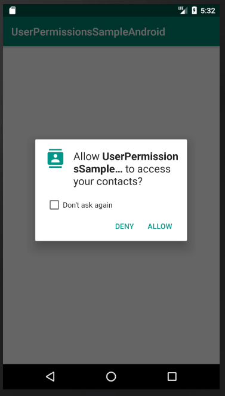

# UserPermissionsSampleAndroid
The app demonstrates a new flow which uses CustomDialogBoxAndroid library to show the reason for requesting a permission before going ahead and asking for user permission.

# Library
The sample uses https://github.com/mailkaran9/CustomDialogBoxAndroid

# Screenshot

